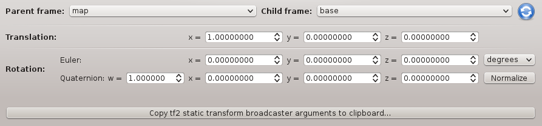
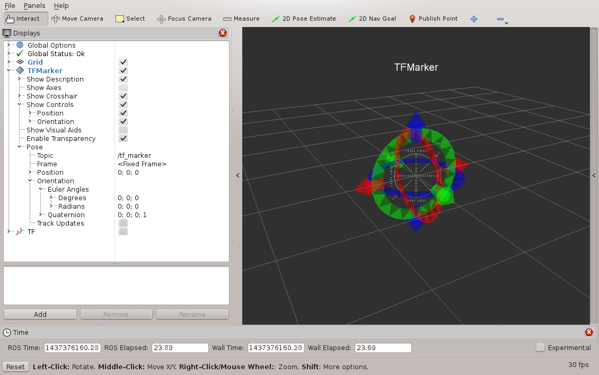

# Plugins Related to ROS TF Frames

## Overview

**Author(s):** Ralf Kaestner

**Maintainer:** Ralf Kaestner <ralf.kaestner@gmail.com>

**Licsense:** GNU Lesser General Public License (LGPL)

**Operating system(s):** Debian-based Linux, Mac OS X

**Package PPA:** Not available

## Content

This project contains the follwing GUI plugins which may be useful when
working with ROS TF frames:

### Static TF Plugin for rqt



### TF Marker for rviz



## Installation

### Dependencies

- [tf2](http://wiki.ros.org/tf2)

  ```shell
  sudo apt-get install ros-indigo-tf2-ros ros-indigo-tf2-geometry-msgs
  ```
 
- [rqt](http://wiki.ros.org/rqt)

  ```shell
  sudo apt-get install ros-indigo-rqt
  ```
 
- [rviz](http://wiki.ros.org/rviz)

  ```shell
  sudo apt-get install ros-indigo-rviz
  ```
 
### Building

Create a symlink in your catkin source folder, e.g.:

  ```shell
  ln -s ~/git/ros-tf-plugins ~/catkin_ws/src
  ```

If you just need certain componenets of the GUI:

  ```shell
  ln -s ~/git/ros-tf-plugins/name_of_the_component ~/catkin_ws/src
  ```

## Usage

### Static TF Plugin for rqt

To launch the standalone rqt plugin, run

  ```shell
  rosrun rqt_static_tf rqt_static_tf
  ```

To launch the rqt GUI without a perspective, run

  ```shell
  rqt --force-discover
  ```

This will discover all plugins, which can then be loaded manually.

To delete the default configuration files (in case of problems):

  ```shell
  rqt --clear-config
  ```

### TF Marker for rviz

To launch rviz and discover the plugin, run

  ```shell
  rosrun rviz rviz
  ```

## Bugs & Feature Requests

Please report bugs and feature requests on the
[Issue Tracker](https://github.com/ethz-asl/ros-tf-plugins).
